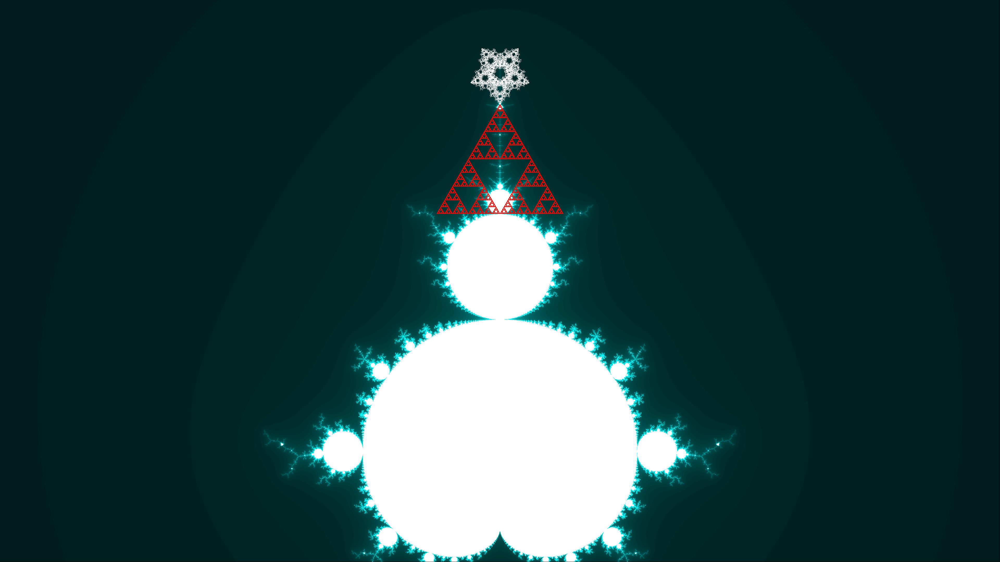
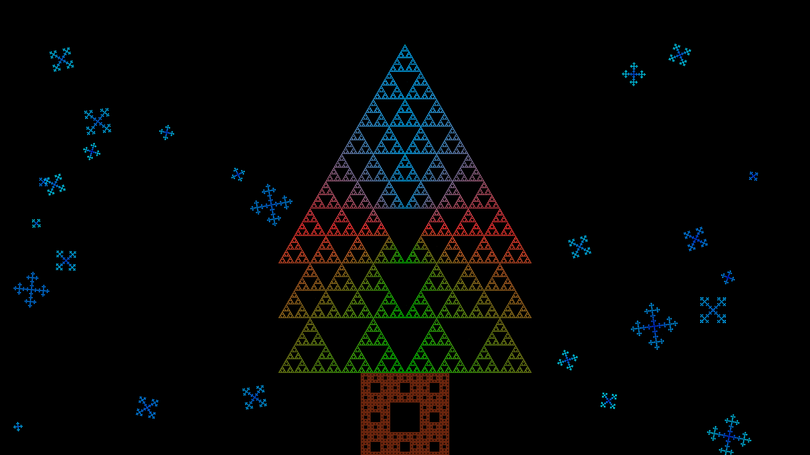

# Frosted Fractals

This is my submission for Frosted Fractals - the fractal making competition hosted by IIT Palakkad's math club, The Mandelbrot Set.

I'm submitting two images:

- Snowmandelbrot: A mandelbrot set snowman, with a Christmas cap on top (made up of fractals as well)
- Sierpinski tree: A christmas tree made up of fractals with fractal snowflakes in the background


## Requirements

Ensure that the Python module `pygame` is installed on your computer. I used the module for everything graphics-related.

To install pygame in a virtual environment, simply use

```
pip install pygame
```

To install it system-wide on a Linux distribution, use

```
sudo apt install python3-pygame
```


## Submissions


*Snowmandelbrot*


*Sierpinski Tree*
