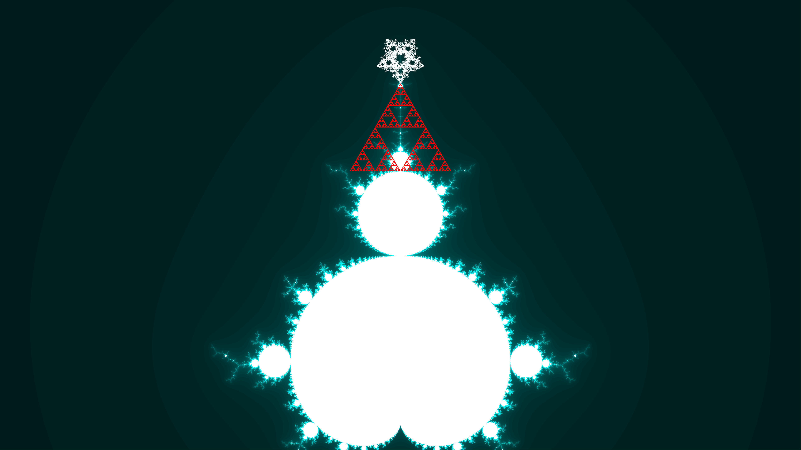

# Snowmandelbrot

## The fractals involved

The *Snowmandelbrot*, as it's name suggests, is a Mandelbrot set as a snowman (snowman + Mandelbrot)

- The main body is a Mandelbrot set, with a snow-like color map, generated by iterating over each of it's points a max of 250 times.

- It's red Santa Claus themed cap is a Sierpinski triangle, consisting of 10,000 points, generated using chaos game.

- The star on top is a restricted chaos-game based fractal, consisting of 42,000 points, generated inside a regular pentagon. The restriction for this is that if the last two chosen vertices are the same, then the new vertex cannot neighbour the previously chosen vertex. The jump ratio is 1/2 here. Check out the others/star directory to see a 10,000 x 10,000 image of this star with 1,00,00,000 points, in it's complete glory.

All the images are at the end of this file as well.

## File contents

Here's some info on the files and directories

- `snowmandelbrot-4k.png`:
    The main image, of a snow-man-delbrot set with a Christmascap. The image is in 4K.

- `utils.py`:
    A Python module with some useful "utility" functions, among some frequently used constants. This module is used by every other `.py` file

- `main.py`:
    The main Python file. Running it should open a window of near-HD resolution. The image should be rendered roughly in a minute. The terminal displays a progress bar to denote how much calculation has been performed for the Mandelbrot set. Do note though that this doesn't say anything about the time taken to plot all those points.

- `sv-main.py`:
    The main Python file for generating and saving a 4K image. Rendering this image will take a considerable amount of time (around 3.5 minutes) and the image will be saved in the current working directory. Again, a progress bar is displayed on the terminal.

- `others`:
    Contains some images of the Mandelbrot set with different color maps. I generated these for fun, and they are meant as showcases of the fractal, not as parts of the actual submission. These color maps can be found in `utils.py`. The `star` sub-directory contains the star in it's full glory and the code used to generate the same. It's recommended to look at the star in an image viewer that smoothens the pixels out. It looks better that way.

## The main image

The Snowmandelbrot
  

## Other images

These are some nice alternative color maps for the Mandelbrot set. All of them were generated using an older version of `main.py`

Mandelbrot Set - Fire
  

Mandelbrot Set - Ice
  

Mandelbrot Set - Snow
  

Mandelbrot Set - Snow (more iterations)
  

Star
  

